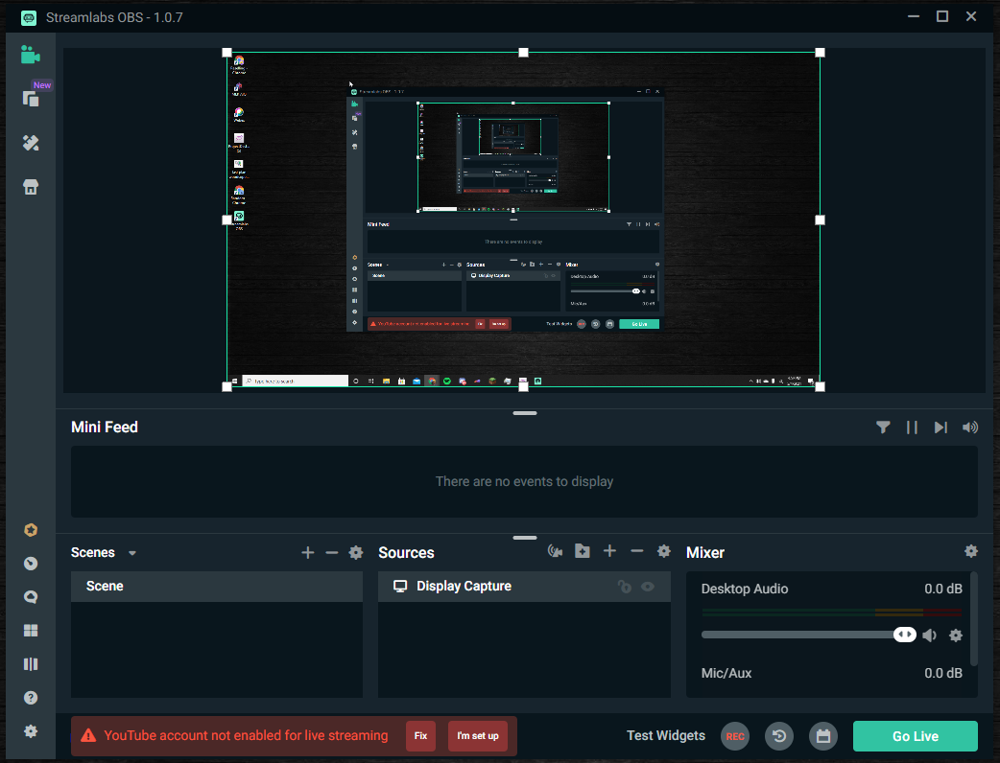

# Instructions Page 1
> In these instruction pages I will be giving step-by-step instructions on how to download and setup a screen/display recording piece of software, then record with the software, and then after that I will be showing how to publish the recording to YouTube, as the example platform for publishing.
## Recording Sofware
So with recording your screen for any type of reason from a school project or maybe for a job. There are many programs that can do screen/display recording. The one I find the easiest to use and understand is [StreamLabs OBS](https://streamlabs.com/). To download follow the steps below:

## Software Download:
### 1. Download [Here](https://streamlabs.com/) or from above!
_Although this is a software suited more for streaming it is still a very good piece of software for recording as well_
### 2. Once downloaded open the software and it should look like this:
  * Click **Agree**
  * Click **Finish** after agree

### 3. Then this pop-up will show on you screen looking like this:
  * Click **Finish** 

### 4. You have now downloaded [StreamLabs OBS!](https://streamlabs.com/) 

## Software Setup Instructions:
### 1. After finishing the steps in the Download section you should see the opening screen of _StreamLabs OBS_.
  * It should look like this:

### 2. Now that the software is open let's go ahead and add a source for the recording, the source for recording your screen would be your display.
  * To add a source click the plus in the source section of the opening window.
   * This is the section:

   
   
  * After clicking the plus icon this window should apppear.
  * In this window Click **Display Capture** and have no widgets selected/clicked, then Click **Add Source** in the bottom left of the window.

  
  
  * Now added/edit a name for your display capture and then Click **Add Source**

  

  * Next you will see a window pop up for the _Setting for Display Capture_, and then you will select your display that you need for recording. And hit **Done** when you're finished

  
  
### 3. Now you have a source to record with Streamlabs OBS!

  

More information about this section to know is that with these other sections is the display and how to use and error fixing can be found [here!](https://streamlabs.com/content-hub/support/support-streamlabs-obs) Any other info need can be found there as well about setting up other feature within the software that you could use in presentations or live streams!

## Audio/Mic Setup
### 1. First you want to go to the **Mixer** section and select the highlighted gear icon to then go to the properties section, as seen below:

### 2. After clicking Properties you should see this screen, pictured below, and then select the output audio you want then click done

### 3. Now to setup Your Microphone
   * First scroll in the mixer section till you see the mic settings gear icon, as picutred below

   

   * Now click the gear icon then click **properties**, which should lead you to the following window. Then select the microphone you want recorded and click done when finished.

   
  
### 4. You now have Audio Ouput and your Microphone setup to record!
  
## Recording Settings & Setup
### 1. Click the gear icon in the bottom left side tab, as pictured below:

### 2. After clicking the gear icon this window should popup:
  * Click **Output** in the left side of the window
  * Scroll till you see the **Recording**

  * Now in this section you can edit the file path for your recordings
  
  
  
  * And you can edit the Qualiting and Format of your recordings

  
  
### 3. Now Click done when you have your setting how you would like them and now you are all setup for recording and posting 

## __Please proceed the InstructionsPage2.md to continue with the instructions__
