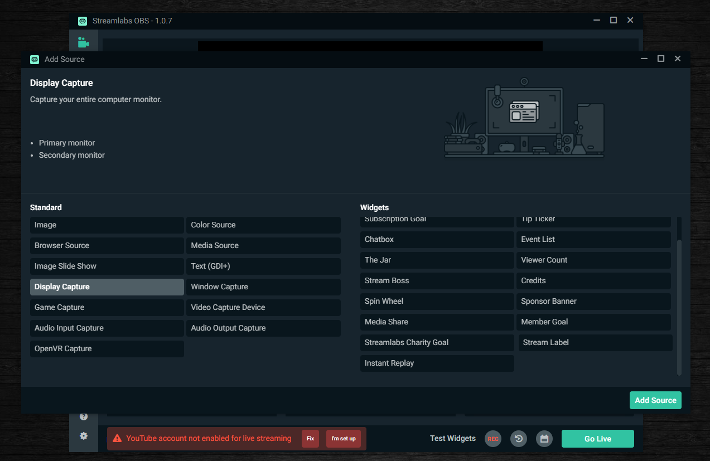

# Instructions Page 1

## Recording Sofware
So with recording your screen for any type of reason from a school project to maybe for a job. There are many programs that can do screen recording. The one I find the easiest to use and understand is [StreamLabs OBS](https://streamlabs.com/). To download follow the steps below:

## Software Download:
### 1. Download [Here](https://streamlabs.com/) or from above!
_Although this is a software suited more for streaming it is still a very good piece of software for recording as well_
### 2. Once downloaded open the software and it should look like this:
  * Click **Agree**
  * Click **Finish** after agree

### 3. Then this pop-up will show on you screen looking like this:
  * Click **Finish** 

### 4. You have now downloaded [StreamLabs OBS!](https://streamlabs.com/) 

## Software Setup Instructions:
### 1. After finishing the steps in the Download section you should see the opening screen of _StreamLabs OBS_.
  * It should look like this:

### 2. Now that the software is open let's go ahead and add a source for the recording, the source for recording your screen would be your display.
  * To add a source click the plus in the source section of the opening window.
   * This is the section:

   
   
  * After clicking the plus icon this window should apppear.
  * In this window Click **Display Capture** and have no widgets selected/clicked, then Click **Add Source** in the bottom left of the window.

  
