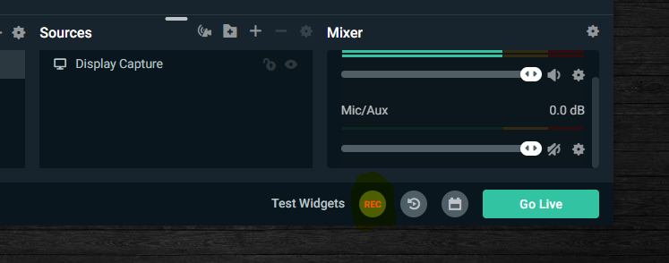
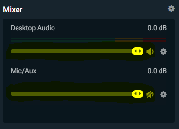
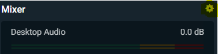
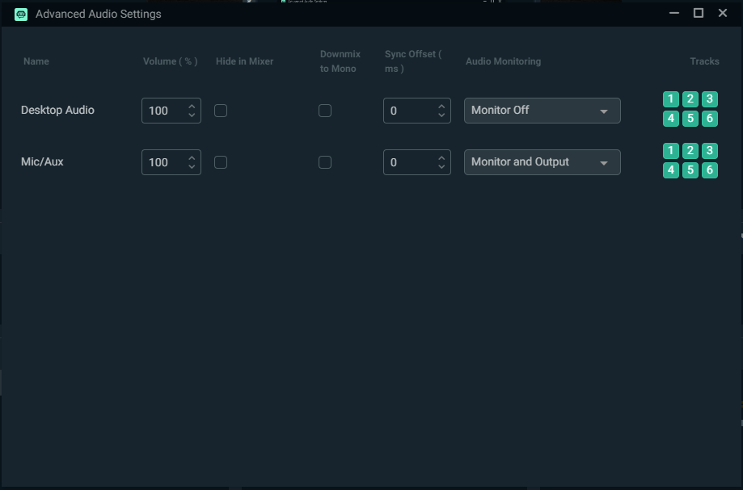
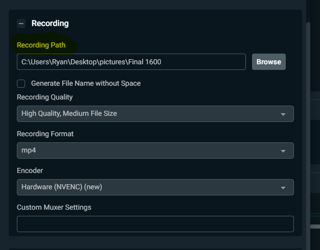
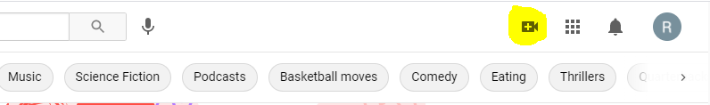

# Instructions Page 2
 ## Recording Your Display
1. Now that you have the display capture setup to where/what you want being recorded you can now record your video! To start recording press the _REC_ button in the bottom right of the display window, and to **STOP** the recording click the same button **AGAIN**, and your recording will be saved to the path you desired in the steps of _Instructions Page 1_.
  * The _REC_ Button:

2. Options when record:
  * You can mute or change the the volume of your computer or your mic by clicking/dragging the highighted volume/sound icon and arrow bar.
  
 
  * You can also edit the settings of your sound in the Advanced Audio Settings
    * First to get to the Advanced Audio settings you have to click the gear icon in the top right coner of the Mixer section:
     
    
    * Now the Advanced Audio Settings shoudl be open and looking like this:

    

3. Now its time to record, just follow the steps of starting and stoping your recording and now we can go get it and then publish it!

4. Finding the recording! 
  * To get the recording you first need to go to the location on your computer that you set the _Recording Path_ to get the video.
    * The recording Path can be found by clicking the **Settings** gear icon. 
    * Click **Output** in the left side of the window.
    * Scroll till you see the Recording Path.
    * For further instruction if needed refer to **InstructionsPage1**.

## Publing Time!
> I will be using [YouTube.com](https://www.youtube.com/) for the upload process in this tutorial. For this you will need to make a google email. For instruction on doing that please click [here!](https://support.google.com/accounts/answer/27441?hl=en)

1. Now that you have your recorded video, go to [YouTube.com](https://www.youtube.com/) and log in if you are not already! Once Logged in please click the icon showed below and click **Upload Video**!

2. 
