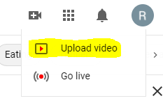

# Instructions Page 2
 ## Recording Your Display
1. Now that you have the display capture setup to where/what you want being recorded you can now record your video! To start recording press the _REC_ button in the bottom right of the display window, and to **STOP** the recording click the same button **AGAIN**, and your recording will be saved to the path you desired in the steps of _Instructions Page 1_.
  * The _REC_ Button:

2. Options when record:
  * You can mute or change the the volume of your computer or your mic by clicking/dragging the highighted volume/sound icon and arrow bar.
  
 
  * You can also edit the settings of your sound in the Advanced Audio Settings
    * First to get to the Advanced Audio settings you have to click the gear icon in the top right coner of the Mixer section:
     
    
    * Now the Advanced Audio Settings shoudl be open and looking like this:

    

3. Now its time to record, just follow the steps of starting and stoping your recording and now we can go get it and then publish it!

4. Finding the recording! 
  * To get the recording you first need to go to the location on your computer that you set the _Recording Path_ to get the video.
    * The recording Path can be found by clicking the **Settings** gear icon. 
    * Click **Output** in the left side of the window.
    * Scroll till you see the Recording Path.
    * For further instruction if needed refer to **InstructionsPage1**.

## Publing Time!
> In these next instructions I will be showing how to take your recording and publish it, I will be using YouTube as the example platoform.

### YouTube
> I will be using [YouTube.com](https://www.youtube.com/) for the upload process in this tutorial. For this you will need to make a google email. For instruction on doing that please click [here!](https://support.google.com/accounts/answer/27441?hl=en)

1. Now that you have your recorded video, go to [YouTube.com](https://www.youtube.com/) and log in if you are not already! Once Logged in please click the icon showed below and click **Upload Video**!

  
 
 

2. Now a window, as shown below, should pop up and now you want to select and upload the recording file from the location of the Recording Path.

 

3. After choosing your file you should be brough to this page to edit the details of your recording like the title, description, thumbnail and much more. And then when you have all the details to how you want them click **Next**.
 * Below is a picture of what this window should look like:

4. Next you will be sent to the **Video Elements Page** and here you are able to add subtitles, add an end screen, and add cards to the video! When you are done just click next to proceed in the uploading process!
 * Here is picture of the **Video Elemetns Page**:

5. After the **Video Elements Page**, you will now be on the **Checks Page**. This page is for YouTube to show the check they do on your video of different things like _copyright_.
 * This is a photo of the **Checks Page**:

6. Now the last page of the publishing process. This page is the **Visibility Page**, here is where you cna setup the settings for the upload of either public posting or privately posting the record and also you can schedule the recording upload!
 * Here is a photo of the **Visibility Page**.

7. When you are all finished with setting up the upload of your recording you can go ahead and click the **Publish** button and the video, if published publically, will show up under your accounts videos for anyone to view. Also you can share the link to your video however you would like and YouTube has capabilities to autmatically share though othe social media platforms!

 * Here is the platofrms you cna share your video on!

> I hope these instructions were able to help you in learninghow to record and publish recording of your computer's display! Also here is a link to my video upload from the instructions: ["INFOTC 1600 Final Project Video Example"](https://www.youtube.com/watch?v=hMrLOnR6vrs)
